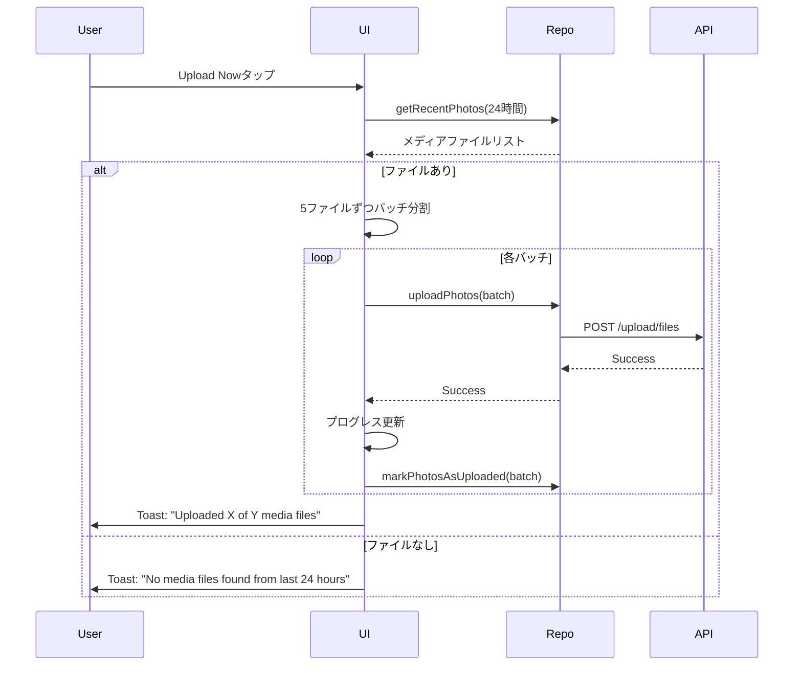
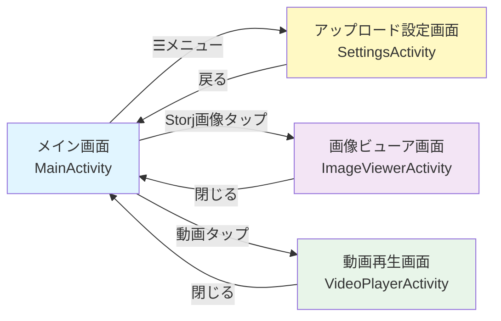
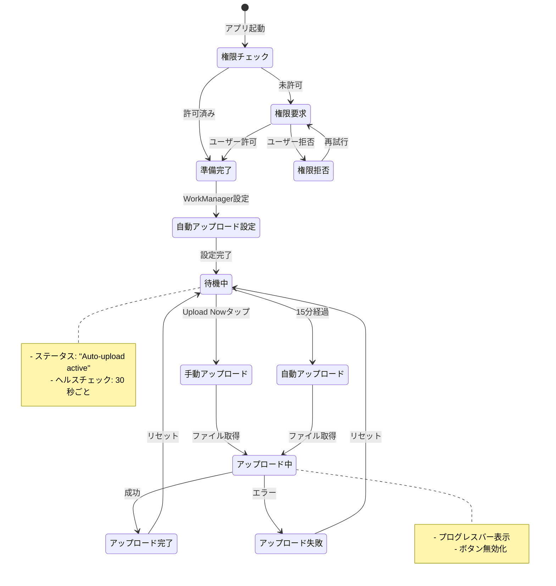
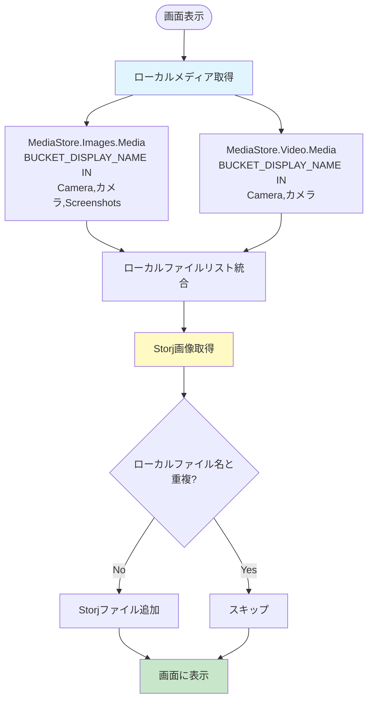
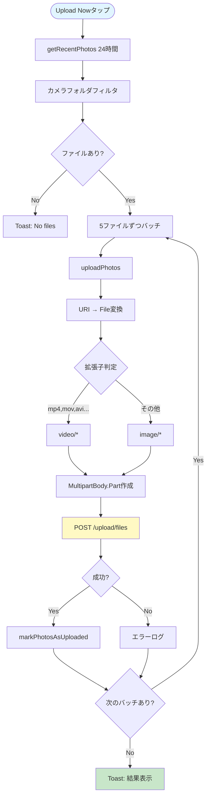

# Storj Photo Uploader - 画面詳細設計書

**最終更新日**: 2025-11-14
**バージョン**: 2.0
**対応するコード**: android_storj_uploader

---

## 目次

1. [概要](#概要)
2. [画面構成](#画面構成)
3. [画面詳細設計](#画面詳細設計)
4. [画面遷移図](#画面遷移図)
5. [状態遷移図](#状態遷移図)
6. [データフロー](#データフロー)
7. [エラーハンドリング](#エラーハンドリング)

---

## 概要

Storj Photo Uploader は、スマートフォンのカメラで撮影した写真・動画を自動的にStorjクラウドストレージにアップロードするAndroidアプリです。

### 主な機能

- ✅ カメラで撮影した写真・動画の一覧表示
- ✅ Storjへの自動アップロード（15分ごと）
- ✅ 手動アップロード機能
- ✅ 画像のフルサイズ表示・ズーム・ダウンロード
- ✅ 動画のストリーミング再生
- ✅ アップロード状態の視覚的表示

### 技術スタック

- **言語**: Kotlin 1.9.25
- **UIフレームワーク**: Android Views (Material Design 3)
- **画像表示**: Glide 4.16.0, PhotoView 2.3.0
- **動画再生**: ExoPlayer (Media3) 1.2.0
- **HTTPクライアント**: Retrofit 2.9.0
- **非同期処理**: Kotlin Coroutines
- **バックグラウンド処理**: WorkManager 2.9.0

---

## 画面構成

アプリは4つの画面で構成されています：

1. **メイン画面（MainActivity）** - 写真・動画一覧
2. **アップロード設定画面（SettingsActivity）** - アップロード一覧・手動実行
3. **画像ビューア画面（ImageViewerActivity）** - 画像詳細表示
4. **動画再生画面（VideoPlayerActivity）** - 動画再生

---

## 画面詳細設計

### 1. メイン画面（MainActivity）

#### 画面レイアウト

```
┌──────────────────────────────────────────┐
│  [80dp空白]                              │ ← 画面上部から10%下
├──────────────────────────────────────────┤
│  Storj Photo Uploader (git-hash)    [☰] │ ← ヘッダー
│  API: Connected ✓                        │
│  Status: Ready - Auto-upload active      │
├──────────────────────────────────────────┤
│  Photos                                  │ ← セクションタイトル
├──────────────────────────────────────────┤
│  ┌──┐ ┌──┐ ┌──┐                         │
│  │✓ │ │✓ │ │▶ │ ← 3カラムグリッド     │
│  └──┘ └──┘ └──┘   (✓=アップロード済み) │
│  ┌──┐ ┌──┐ ┌──┐   (▶=動画)            │
│  │  │ │  │ │✓ │                         │
│  └──┘ └──┘ └──┘                         │
│  ...                                     │
└──────────────────────────────────────────┘
```

#### レイアウトファイル

- `activity_main.xml`
- `item_photo_grid.xml`

#### 画面要素

| 要素 | ID | 説明 |
|------|----|----- |
| **タイトルテキスト** | `titleText` | `Storj Photo Uploader (git-commit-hash)` |
| **設定ボタン** | `settingsButton` | ☰ メニューアイコン、タップでポップアップメニュー表示 |
| **ヘルスチェックテキスト** | `healthCheckText` | `API: Connected ✓` (緑) / `API: Disconnected ✗` (赤) |
| **ステータステキスト** | `statusText` | 現在の状態を表示 |
| **写真グリッド** | `photoGridRecyclerView` | 3カラムのGridLayoutManager |
| **スワイプリフレッシュ** | `swipeRefreshLayout` | 下スワイプで画面更新 |

#### GridアイテムUI

```
┌─────────┐
│         │
│  画像   │ ← サムネイル表示（Glide）
│         │
│    ✓    │ ← アップロード済みバッジ（右上）
│    ▶    │ ← 動画アイコン（中央）
└─────────┘
```

- **サイズ**: 画面幅の1/3
- **アスペクト比**: 1:1（正方形）
- **タップアクション**:
  - Storj画像 → ImageViewerActivity
  - Storj動画 → VideoPlayerActivity
  - ローカル動画 → VideoPlayerActivity
  - ローカル画像 → （未対応）

#### ヘッダー部分のレイアウト調整

- **上部マージン**: `android:layout_marginTop="80dp"`
- **目的**: 画面上部から10%下に配置（ノッチ・パンチホール対応）

#### 状態管理

| 状態 | ステータステキスト | ヘルスチェック |
|------|--------------------|----------------|
| 初期化中 | `Ready` | `API: Checking...` |
| 正常 | `Auto-upload active (every 15 min)` | `API: Connected ✓` (緑) |
| API切断 | `Auto-upload active (every 15 min)` | `API: Disconnected ✗` (赤) |
| 権限付与後 | `Permissions granted` | - |
| 権限拒否 | `Permission denied - Cannot access media` | - |

#### 権限管理

**Android 13+ (API 33+)**:
- `READ_MEDIA_IMAGES` - 写真アクセス
- `READ_MEDIA_VIDEO` - 動画アクセス

**Android 12以下 (API 32-)**:
- `READ_EXTERNAL_STORAGE` - ストレージアクセス

#### データ取得ロジック

```kotlin
// PhotoRepository.kt: getAllPhotosWithStatus()
1. MediaStore.Images.Media から写真を取得（カメラフォルダのみ）
2. MediaStore.Video.Media から動画を取得（カメラフォルダのみ）
3. Storj API から画像・動画一覧を取得
4. ローカルファイル名と重複しないStorjファイルを追加
5. PhotoItem リストを返す
```

**カメラフォルダフィルタ**:
```kotlin
BUCKET_DISPLAY_NAME IN ("Camera", "カメラ", "Screenshots")
```

#### ヘルスチェック

- **実行間隔**: 30秒ごと
- **API**: `GET /health`
- **表示**: `API: Connected ✓` (緑) / `API: Disconnected ✗` (赤)

---

### 2. アップロード設定画面（SettingsActivity）

#### 画面レイアウト

```
┌──────────────────────────────────────────┐
│  ← アップロード一覧              [メニュー]│ ← ヘッダー
├──────────────────────────────────────────┤
│                                          │
│  Status: Ready                           │
│                                          │
│  ┌────────────────────────────────────┐ │
│  │     Upload Now                     │ │ ← 手動アップロードボタン
│  └────────────────────────────────────┘ │
│                                          │
│  ┌────────────────────────────────────┐ │
│  │████████████░░░░░░░░░░░░░░░░░░░░░░░│ │ ← プログレスバー（アップロード中のみ）
│  └────────────────────────────────────┘ │
│  15 / 30 media files uploaded            │
│                                          │
└──────────────────────────────────────────┘
```

#### レイアウトファイル

- `activity_settings.xml`

#### 画面要素

| 要素 | ID | 説明 |
|------|----|----- |
| **メニューボタン** | `menuButton` | ポップアップメニュー（メイン画面に戻る） |
| **ステータステキスト** | `statusText` | 現在の状態を表示 |
| **Upload Nowボタン** | `uploadNowButton` | 手動アップロード実行 |
| **プログレスバー** | `uploadProgressBar` | アップロード進捗（0-100%） |
| **プログレステキスト** | `progressText` | `X / Y media files uploaded` |

#### アップロードフロー



#### 状態管理

| 状態 | ボタン | プログレスバー | ステータス |
|------|--------|----------------|-----------|
| 待機中 | 有効 | 非表示 | `Ready` |
| アップロード中 | 無効 | 表示 | `Uploading media files...` |
| 完了 | 有効 | 非表示 | `Upload successful: X media files uploaded` |
| エラー | 有効 | 非表示 | `Error: [message]` |

---

### 3. 画像ビューア画面（ImageViewerActivity）

#### 画面レイアウト

```
┌──────────────────────────────────────────┐
│  [80dp空白]                              │ ← 画面上部から10%下
├──────────────────────────────────────────┤
│  [×] image_001.jpg                  [⬇] │ ← ヘッダー（グラデーション背景）
├──────────────────────────────────────────┤
│                                          │
│                                          │
│                                          │
│          [ズーム可能な画像表示]          │
│                                          │
│                                          │
│                                          │
├──────────────────────────────────────────┤
│  ファイル名: image_001.jpg               │ ← フッター（画像情報）
│  サイズ: 2.5 MB                          │
│  日時: 2024-11-14 15:30                  │
└──────────────────────────────────────────┘
```

#### レイアウトファイル

- `activity_image_viewer.xml`

#### 画面要素

| 要素 | ID | 説明 |
|------|----|----- |
| **閉じるボタン** | `closeButton` | × アイコン、タップで画面を閉じる |
| **ダウンロードボタン** | `downloadButton` | ⬇ アイコン、端末に保存 |
| **画像ビュー** | `photoView` | PhotoView（ズーム・パン対応） |
| **ファイル名** | `fileNameText` | 画像ファイル名 |
| **サイズ** | `fileSizeText` | ファイルサイズ（MB） |
| **日時** | `fileDateText` | 撮影日時 |

#### 機能

- **ズーム**: ピンチイン・ピンチアウト
- **パン**: ドラッグでスクロール
- **ダウンロード**: DownloadManagerで端末に保存（Downloadフォルダ）

#### 画像URL構築

```kotlin
val baseUrl = RetrofitClient.BASE_URL.trimEnd('/')  // 末尾の / を削除
val imageUrl = "$baseUrl/storj/images/$imagePath?thumbnail=false"
```

**重要**: `trimEnd('/')` でダブルスラッシュ（//）を防止

---

### 4. 動画再生画面（VideoPlayerActivity）

#### 画面レイアウト

```
┌──────────────────────────────────────────┐
│  [80dp空白]                              │ ← 画面上部から10%下
├──────────────────────────────────────────┤
│  [×] video_001.mp4                       │ ← ヘッダー（グラデーション背景）
├──────────────────────────────────────────┤
│                                          │
│                                          │
│                                          │
│          [動画再生エリア]                │
│                                          │
│                                          │
│                                          │
├──────────────────────────────────────────┤
│  00:15 ━━━━━━━━━━━━━━━━━ 03:42          │ ← コントロールバー
│     [⏪]     [▶]     [⏩]                │   （下から80dp上）
│  [80dp空白]                              │
└──────────────────────────────────────────┘
```

#### レイアウトファイル

- `activity_video_player.xml`
- `custom_player_control.xml`

#### 画面要素

| 要素 | ID | 説明 |
|------|----|----- |
| **閉じるボタン** | `closeButton` | × アイコン、タップで画面を閉じる |
| **タイトルテキスト** | `titleText` | 動画ファイル名 |
| **プレイヤービュー** | `playerView` | ExoPlayerのPlayerView |
| **ローディング** | `loadingProgress` | 読み込み中のプログレスバー |
| **エラーテキスト** | `errorText` | エラーメッセージ表示 |

#### カスタムコントロール（custom_player_control.xml）

| 要素 | ID | 説明 |
|------|----|----- |
| **現在位置** | `exo_position` | 00:15 形式 |
| **シークバー** | `exo_progress` | DefaultTimeBar |
| **総時間** | `exo_duration` | 03:42 形式 |
| **巻き戻しボタン** | `exo_rew` | 10秒巻き戻し |
| **再生/一時停止** | `exo_play_pause` | 再生・一時停止トグル |
| **早送りボタン** | `exo_ffwd` | 10秒早送り |

#### レイアウト調整

**ヘッダー（topToolbar）**:
```xml
android:layout_marginTop="80dp"
```

**コントロールバー（custom_player_control.xml）**:
```xml
android:layout_marginBottom="80dp"
```

**目的**: スマートフォンの下部ナビゲーションやノッチとの干渉を避ける

#### 動画URL構築

```kotlin
val videoUrl = if (videoPath.startsWith("content://")) {
    // ローカル動画URI
    videoPath
} else {
    // Storj動画URL
    val baseUrl = RetrofitClient.BASE_URL.trimEnd('/')
    "$baseUrl/storj/images/$videoPath?thumbnail=false"
}
```

#### ExoPlayer設定

```kotlin
player = ExoPlayer.Builder(this).build().also { exoPlayer ->
    playerView.player = exoPlayer
    val mediaItem = MediaItem.fromUri(videoUrl)
    exoPlayer.setMediaItem(mediaItem)
    exoPlayer.prepare()
    exoPlayer.playWhenReady = true
}
```

#### 状態管理

| 状態 | 表示 |
|------|------|
| BUFFERING | ローディングプログレスバー表示 |
| READY | ローディング非表示、動画再生可能 |
| ENDED | 動画再生終了 |
| ERROR | エラーメッセージ表示 |

---

## 画面遷移図



---

## 状態遷移図



---

## データフロー

### 写真・動画の取得フロー



### アップロードフロー



---

## エラーハンドリング

### エラーケースと対処

| エラーケース | 検出場所 | 対処 |
|-------------|----------|------|
| **権限拒否** | MainActivity | Toast表示、自動アップロード無効化 |
| **API接続エラー** | MainActivity (ヘルスチェック) | `API: Disconnected ✗` 表示（赤） |
| **アップロードエラー** | PhotoRepository.uploadPhotos() | Toast表示、ログ出力 |
| **動画再生エラー** | VideoPlayerActivity | エラーテキスト表示 |
| **画像読み込みエラー** | ImageViewerActivity | Glideのエラーハンドラ |
| **URI変換エラー** | PhotoRepository.uriToFile() | ログ出力、スキップ |
| **ファイルサイズ超過** | Backend API | 400 Bad Request、Toast表示 |

### ログ出力

```kotlin
Log.d(TAG, "詳細なデバッグ情報")
Log.w(TAG, "警告メッセージ")
Log.e(TAG, "エラーメッセージ", exception)
```

**確認方法**:
```bash
adb logcat -s MainActivity:D PhotoRepository:D ImageViewerActivity:D VideoPlayerActivity:D
```

---

## パフォーマンス最適化

### 画像表示

- **Glide**: メモリキャッシュ・ディスクキャッシュ自動管理
- **サムネイル**: `centerCrop()` で正方形にトリミング
- **プレースホルダー**: `placeholder(android.R.drawable.ic_menu_gallery)`

### 動画再生

- **ストリーミング**: ExoPlayerが自動的にバッファリング
- **ライフサイクル管理**: onStop()でplayer.release()

### バックグラウンド処理

- **WorkManager**: ネットワーク接続時のみ実行
- **バッチアップロード**: 5-10ファイルずつ
- **リトライ**: BackoffPolicy.LINEAR

---

## アクセシビリティ

- すべてのImageButtonに`contentDescription`設定
- テキストサイズ: 12sp-20sp
- タップ可能要素: 最小48dp
- カラーコントラスト: 緑（成功）/赤（エラー）

---

## まとめ

このアプリは**4画面構成**で、以下の特徴があります：

- ✅ カメラフォルダの写真・動画のみを対象
- ✅ Storjと連携した自動バックアップ
- ✅ 画像・動画の詳細表示機能
- ✅ 視覚的なフィードバック（✓マーク、プログレスバー）
- ✅ UI位置調整（ノッチ・ナビゲーションバー対応）
- ✅ エラーハンドリングとリトライ機構
