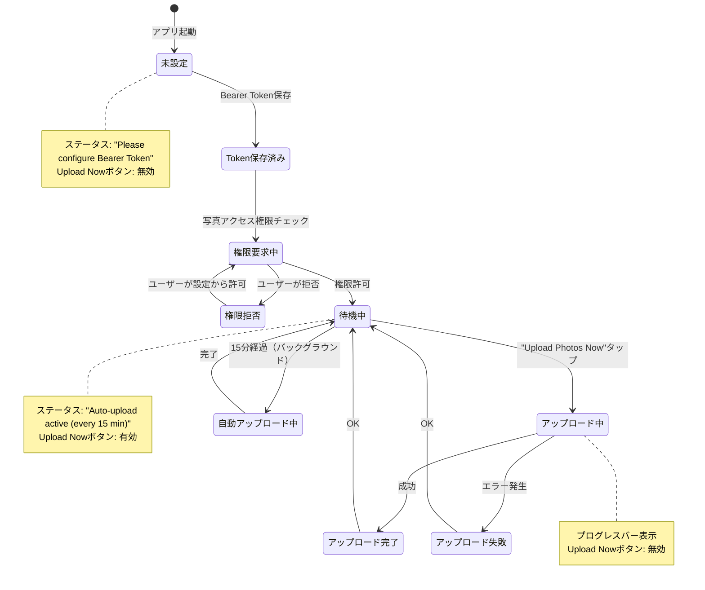
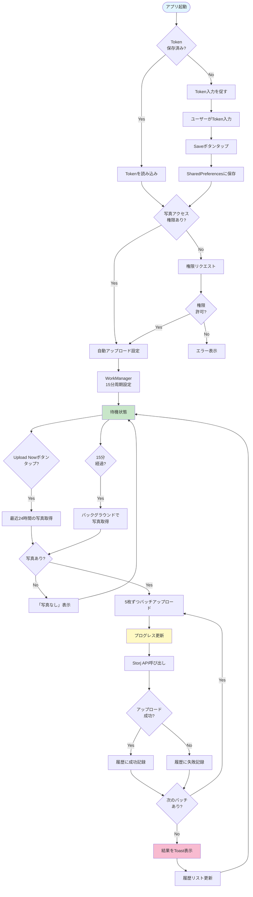
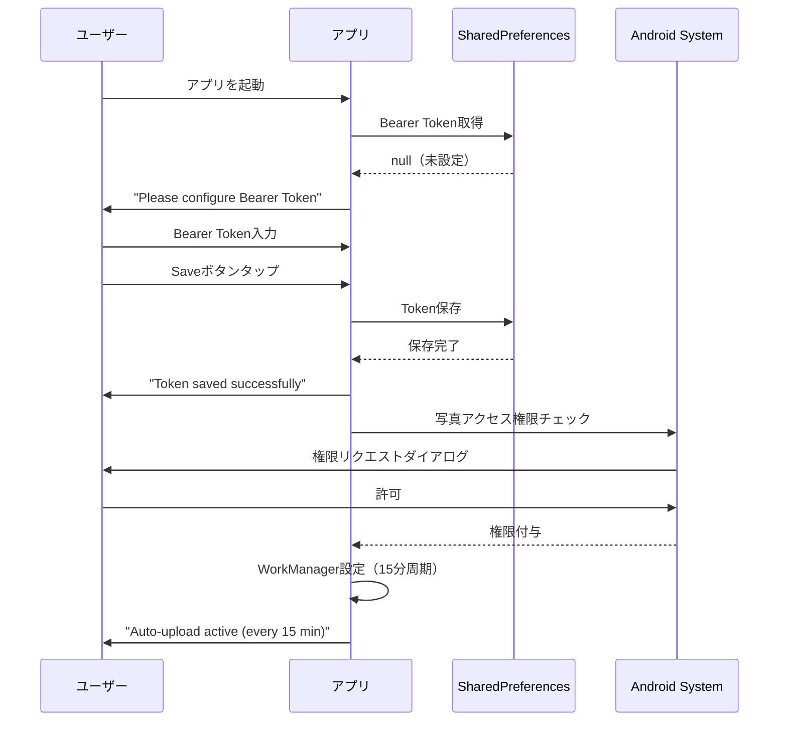
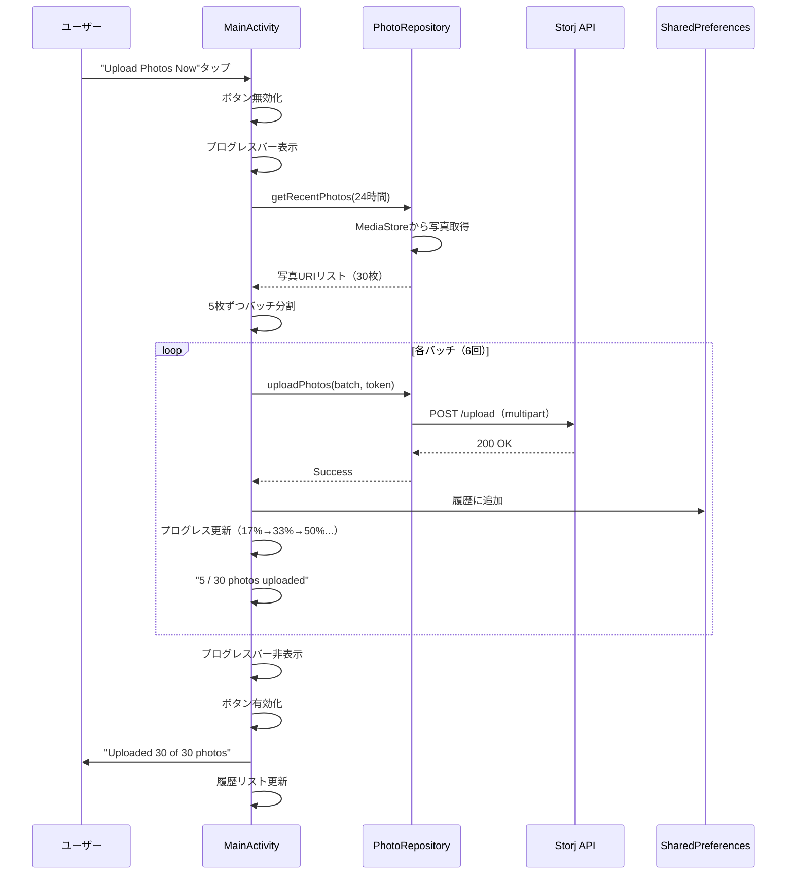
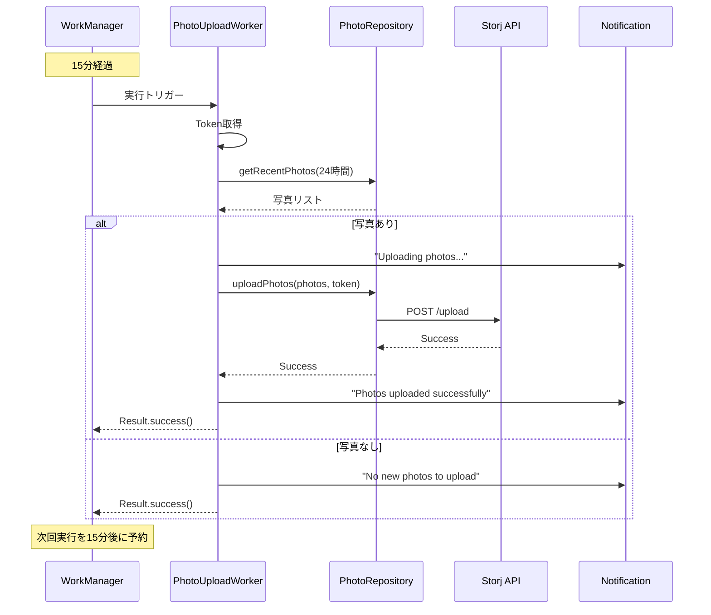

# 画面設計書

## 画面構成

このアプリは単一画面（MainActivity）で構成されており、画面遷移はありません。すべての機能が1つの画面に統合されています。

## メイン画面（MainActivity）

### 画面レイアウト

```
┌─────────────────────────────────────────┐
│                                         │
│  Storj Photo Uploader (git-hash)       │
│                                         │
│  ┌──────────────────┐  ┌────────┐     │
│  │ Bearer Token     │  │  Save  │     │
│  │ **************** │  └────────┘     │
│  └──────────────────┘                  │
│                                         │
│  Status: Ready - Auto-upload active    │
│                                         │
│  ┌────────────────────────────────┐   │
│  │████████████░░░░░░░░░░░░░░░░░░░│   │ ← プログレスバー
│  └────────────────────────────────┘   │
│  15 / 30 photos uploaded               │
│                                         │
│  ┌────────────────────────────────┐   │
│  │    Upload Photos Now           │   │
│  └────────────────────────────────┘   │
│                                         │
├─────────────────────────────────────────┤ ← 区切り線
│                                         │
│  Upload History                        │
│                                         │
│  ┌───────────────────────────────┐    │
│  │ ┌───┐  image_001.jpg          │    │
│  │ │img│  2024-11-09 10:30       │    │
│  │ └───┘  Success ✓              │    │
│  └───────────────────────────────┘    │
│  ┌───────────────────────────────┐    │
│  │ ┌───┐  image_002.jpg          │    │
│  │ │img│  2024-11-09 10:29       │    │
│  │ └───┘  Success ✓              │    │
│  └───────────────────────────────┘    │
│  ┌───────────────────────────────┐    │
│  │ ┌───┐  image_003.jpg          │    │
│  │ │img│  2024-11-09 10:28       │    │
│  │ └───┘  Failed ✗               │    │
│  └───────────────────────────────┘    │
│  ...                                   │
└─────────────────────────────────────────┘
```

### 画面構成要素

#### 上部エリア（1/4画面）- アップロード制御

| 要素 | 説明 |
|------|------|
| **タイトル** | `Storj Photo Uploader (git-hash)` - アプリ名とコミットハッシュ |
| **Bearer Token入力** | パスワード形式のテキストフィールド |
| **Saveボタン** | Tokenを保存し、自動アップロードを有効化 |
| **ステータステキスト** | 現在の状態を表示 |
| **プログレスバー** | アップロード進捗（0-100%） |
| **プログレステキスト** | `X / Y photos uploaded` |
| **Upload Photos Nowボタン** | 手動アップロードを実行 |

#### 下部エリア（3/4画面）- アップロード履歴

| 要素 | 説明 |
|------|------|
| **Upload Historyタイトル** | セクションタイトル |
| **RecyclerView** | スクロール可能なリスト表示 |
| **SwipeRefreshLayout** | 下にスワイプで履歴を更新 |

#### 履歴アイテム（item_upload_history.xml）

各履歴アイテムは以下の情報を表示：

```
┌─────────────────────────────────────┐
│ ┌───────┐                           │
│ │       │  image_20241109_103045.jpg│
│ │ 80x80 │  2024-11-09 10:30:45      │
│ │ thumb │  Success                  │
│ └───────┘                           │
└─────────────────────────────────────┘
```

- **サムネイル**: 80x80pxの画像プレビュー
- **ファイル名**: 最大1行、超過時は省略
- **アップロード時刻**: YYYY-MM-DD HH:MM形式
- **ステータス**: Success（緑）/ Failed（赤）

## 状態遷移図



## 機能フロー図



## ユーザーインタラクション

### 1. 初回起動フロー



### 2. 手動アップロードフロー



### 3. 自動アップロードフロー（バックグラウンド）



## 画面コンポーネント詳細

### UI要素の状態

| 要素 | 初期状態 | Token保存後 | アップロード中 |
|------|----------|-------------|----------------|
| Token入力フィールド | 空 | 保存済みToken表示（*で隠す） | 編集不可 |
| Saveボタン | 有効 | 有効 | 無効 |
| Upload Nowボタン | 無効 | 有効 | 無効 |
| プログレスバー | 非表示 | 非表示 | 表示（0-100%） |
| プログレステキスト | 非表示 | 非表示 | 表示 |
| ステータステキスト | "Please configure Bearer Token" | "Auto-upload active (every 15 min)" | "Uploading photos..." |

### ステータスメッセージ一覧

| ステータス | 表示タイミング |
|-----------|----------------|
| `Please configure Bearer Token` | アプリ起動時（Token未設定） |
| `Token saved` | Token保存成功時 |
| `Permission granted` | 写真アクセス権限取得時 |
| `Permission denied - Cannot access photos` | 権限拒否時 |
| `Auto-upload active (every 15 min)` | 自動アップロード設定完了時 |
| `Ready - Auto-upload active` | 待機状態（Token設定済み） |
| `Uploading photos...` | アップロード開始時 |
| `Upload successful: X photos uploaded` | アップロード完了時 |
| `Upload failed` | アップロード失敗時 |
| `No recent photos to upload` | アップロード対象なし時 |
| `Error: [エラーメッセージ]` | 例外発生時 |

## データ永続化

### SharedPreferences

| キー | 値の型 | 説明 |
|------|--------|------|
| `bearer_token` | String | Storj API認証用Bearer Token |
| `upload_history` | JSON String | アップロード履歴（最大100件） |

### アップロード履歴のJSON形式

```json
[
  {
    "id": 1699500645000,
    "photoUri": "content://media/external/images/media/12345",
    "fileName": "IMG_20241109_103045.jpg",
    "uploadTime": 1699500645000,
    "status": "SUCCESS"
  },
  {
    "id": 1699500632000,
    "photoUri": "content://media/external/images/media/12344",
    "fileName": "IMG_20241109_103032.jpg",
    "uploadTime": 1699500632000,
    "status": "FAILED"
  }
]
```

## バックグラウンド処理

### WorkManager設定

- **実行間隔**: 15分（PeriodicWorkRequest）
- **制約**: ネットワーク接続必須
- **バックオフポリシー**: LINEAR（最小間隔）
- **ユニーク性**: `PhotoUploadWork`（KEEP - 既存のワークを保持）

### Worker実行条件

1. ✅ 15分以上経過
2. ✅ ネットワーク接続あり
3. ✅ Bearer Token設定済み
4. ✅ 写真アクセス権限あり

## エラーハンドリング

| エラー種類 | 処理 |
|-----------|------|
| Token未設定 | Upload Nowボタン無効化、メッセージ表示 |
| 権限拒否 | Toastでエラー表示、自動アップロード無効 |
| ネットワークエラー | リトライ（WorkManager自動）、履歴に失敗記録 |
| API 4xx/5xxエラー | 履歴に失敗記録、Toast表示 |
| 例外発生 | ログ出力、Toast表示、履歴に失敗記録 |

## 画面サイズ対応

- **レイアウト**: LinearLayout（縦方向）
- **上部エリア**: layout_weight="1"（25%）
- **下部エリア**: layout_weight="3"（75%）
- **RecyclerView**: スクロール可能（全履歴表示）
- **アイテム**: Material CardView（elevation 4dp、corner radius 8dp）

## アクセシビリティ

- すべてのImageViewに`contentDescription`設定
- テキストサイズ: 12sp-20sp（読みやすいサイズ）
- タップ可能要素: 最小48dp
- カラーコントラスト: 成功（緑）/失敗（赤）で視覚的に区別

## まとめ

このアプリは**シングルアクティビティ**設計で、画面遷移はありません。すべての機能が1つの画面に統合され、以下の特徴があります：

- ✅ シンプルな操作フロー（Token設定→アップロード）
- ✅ 自動アップロード（15分周期のバックグラウンド処理）
- ✅ 手動アップロード（即座に実行）
- ✅ 視覚的なフィードバック（プログレスバー、ステータス）
- ✅ アップロード履歴の永続化と表示
- ✅ エラーハンドリングとリトライ機構
